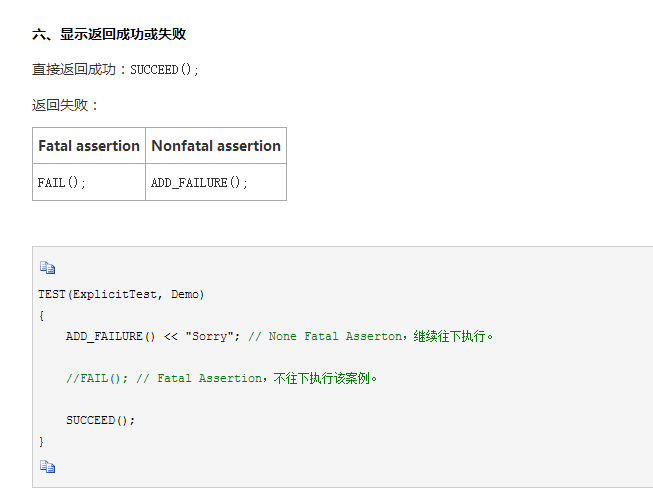
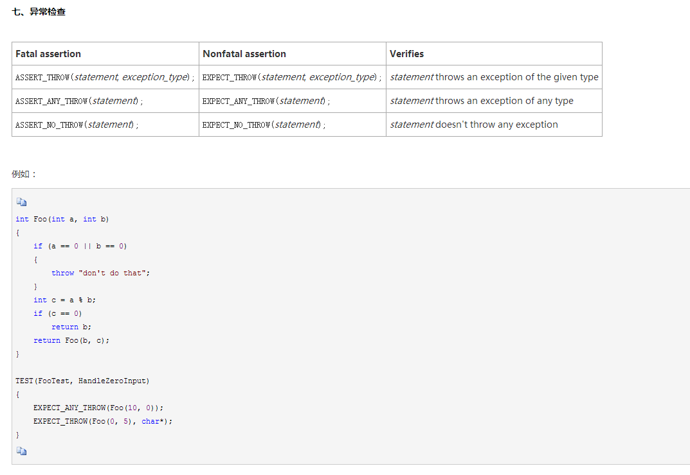
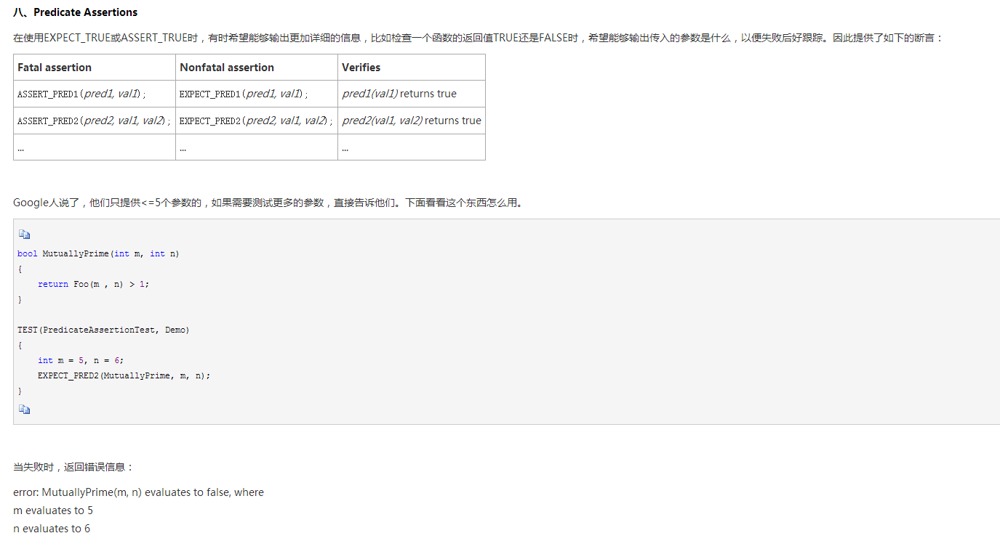
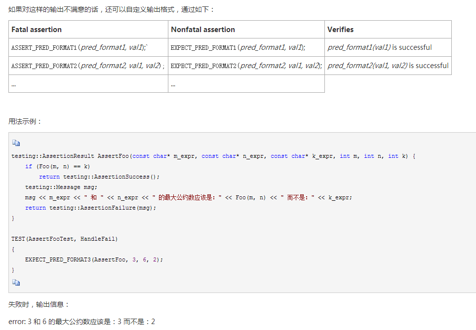
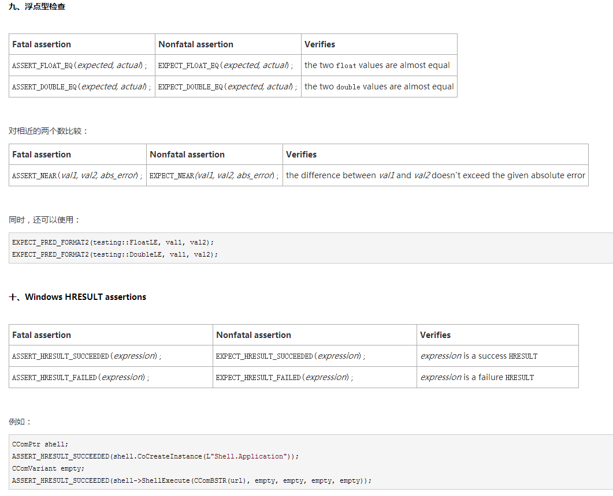
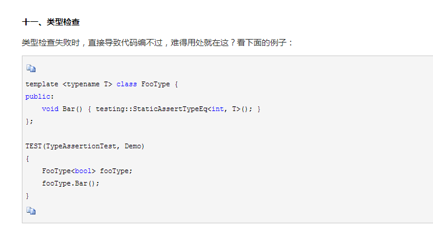

# gtest 谷歌C++测试框架

---

## 源码地址
https://github.com/google/googletest

## 编译
当前的版本 `googletest-1.10.x` 已经支持 CMake，使用 CMake 生成工程文件，在相应的软件中进行编译。

## 使用说明

### main 函数格式

```
int _tmain(int argc, _TCHAR* argv[])
{
    testing::InitGoogleTest(&argc, argv);
    return RUN_ALL_TESTS();
}
```
`testing::InitGoogleTest(&argc, argv);`    支持命令行参数
`RUN_ALL_TESTS();`    运行所有测试用例

### 断言的使用

* ASSERT_* 系列的断言，当检查点失败时，退出当前函数（注意：并非退出当前案例）。 
* EXPECT_* 系列的断言，当检查点失败时，继续往下执行。

#### 布尔值检查

| Fatal assertion	 	   | Nonfatal  assertion      | Verifies           |
| :----------------------- | :----------------------- | :----------------- |
| ASSERT_TRUE(condition);  | EXPECT_TRUE(condition);  | condition is true  |
| ASSERT_FALSE(condition); | EXPECT_FALSE(condition); | condition is false |

#### 数值型检查
| Fatal assertion	 	   | Nonfatal  assertion      | Verifies           |
| :--- | :--- | :--- |
|  ASSERT_EQ(expected, actual);   |  EXPECT_EQ(expected, actual);   |   expected == actual  |
| ASSERT_NE(val1, val2);   | EXPECT_NE(val1, val2);   | val1 != val2   |
| ASSERT_LT(val1, val2);   | EXPECT_LT(val1, val2);   | val1 < val2   |
| ASSERT_LE(val1, val2);   | EXPECT_LE(val1, val2);   | val1 <= val2   |
| ASSERT_GT(val1, val2);   | EXPECT_GT(val1, val2);   | val1 > val2   |
| ASSERT_GE(val1, val2);   | EXPECT_GE(val1, val2);   | val1 >= val2   |

#### 字符串检查

| Fatal assertion                                | Nonfatal  assertion                           | Verifies                                               |
| :--------------------------------------------- | :-------------------------------------------- | :----------------------------------------------------- |
| ASSERT_STREQ(expected_str, actual_str);		 | EXPECT_STREQ(expected_str, actual_str); 	     | the two C strings have the same                        |
| ASSERT_STRNE(str1, str2);						 | EXPECT_STRNE(str1, str2);					 | the two C strings have different content               |
| ASSERT_STRCASEEQ(expected_str, actual_str);	 | EXPECT_STRCASEEQ(expected_str, actual_str);   | the two C strings have the same content, ignoring case |
| ASSERT_STRCASENE(str1, str2);					 | EXPECT_STRCASENE(str1, str2);				 | the two C strings have different content, ignoring case |

*STREQ*和*STRNE*同时支持char*和wchar_t*类型的，*STRCASEEQ*和*STRCASENE*却只接收char*











### 参考

https://www.cnblogs.com/coderzh/archive/2009/04/06/1426755.html
